# BhāratBrain · Team Brief

> **Working repository for our 2026 IISc AI Challenge for Healthy Brain Aging proposal.**
> Submission deadline: **2026-05-20**. Today: **2026-04-30**. Twenty days.

This is the single landing page for the team. If you are a collaborator who has just been added — read this README from top to bottom (≈ 25 minutes), then jump to the section on your delegated task.

---

## 1. The Challenge

The **Centre for Brain Research (CBR), IISc Bangalore**, is running the **2026 AI Challenge for Healthy Brain Aging** — a ₹2 crore prize for AI proposals that advance early detection, prevention, or management of cognitive decline in the Indian context.

- **Prize:** ₹2 crore (research grant)
- **Deliverable:** 3-page proposal (no working prototype required)
- **Deadline:** **20 May 2026**
- **Challenge home:** [cbr.iisc.ac.in](https://cbr.iisc.ac.in/)
- **Judges:** CBR scientists led by **Prof. Vijayalakshmi Ravindranath** (CBR founding director, Padma Shri).

The challenge is *scientifically* judged. Innovation, methodological rigor, India-specific relevance, and credible deployment pathway all matter — not flashy claims.

---

## 2. The Problem

India has a population-scale dementia crisis that Western AI cannot solve.

- **~8.8 million Indians** live with dementia today; an estimated **~80% remain undiagnosed**.
- India has the world's largest type-2 diabetes population — **~101 million** (ICMR-INDIAB-17, *Lancet D&E* 2023) — with ~57% nationally undiagnosed. T2D is one of the strongest *modifiable* risk factors for Alzheimer's.
- India's dementia risk-factor profile (education and vision impairment dominant; hearing loss less central) is *different* from the West (Lancet Commission on Dementia, 2024).
- MRI-based Alzheimer's tools reach roughly 0.1% of at-risk Indians. Community-level screening using whatever data ASHA workers can collect is the only realistic path to scale.
- Existing AI systems trained on Western datasets (ADNI, etc.) systematically under-perform on Indian populations.



India is also the **only country** that simultaneously has:
1. The world's largest T2D burden with the earliest global onset,
2. A rural/urban paired longitudinal dementia cohort with metabolic panels (**SANSCOG / TLSA** at IISc CBR),
3. A 1 million+ **ASHA** community-health-worker deployment channel,
4. 22 official languages requiring native (not translated) cognitive assessment.

**No Western team can credibly claim what we can.** That is the proposal's thesis sentence.

---

## 3. Where We Are



In the last four weeks, the team (Sanjay leading the bulk of work) has:
- Made **6 strategic decisions** about goal, skills, scope, users, data, and India advantage
- Run **4 deep-research threads** (Federated Learning, Multilingual LLM, T2D-Alzheimer's, Winning Proposals) and put each through a multi-model verification pass
- Designed and **rubric-scored 5 distinct solution options**
- Synthesized a **lead candidate — *BhāratBrain*** (Options 1+5+3, scored 96.2/100)
- **Purged 13+ fabricated claims** from initial GPT-Researcher reports (see `deep-research/synthesis_critique.md`)

We are **not starting from zero**. We are at the point where the lead candidate needs to be stress-tested, the problem needs to be sharpened, and the proposal needs to be written.

---

## 4. What We've Done So Far — Annotated Index

Read these in order if you want the narrative arc:

| File | What it is | Why it exists |
|---|---|---|
| [`00_strategy_brief.md`](00_strategy_brief.md) | The 6 team decisions before any research | Anchors the *why* — read first |
| [`01_research_direction_overview.md`](01_research_direction_overview.md) | Six research directions evaluated | The fork-in-the-road selection |
| [`02_research_frugal_ai.md`](02_research_frugal_ai.md) | Blood biomarkers, literacy-independent cognitive apps, missing-modality ML | Establishes the no-MRI evidence base |
| [`03_research_llm_decision_support.md`](03_research_llm_decision_support.md) | Multi-agent LLMs, speech biomarkers, multilingual gaps | The LLM-native angle |
| [`04_research_india_diabetes_alzheimers.md`](04_research_india_diabetes_alzheimers.md) | India epidemiology, T2D-AD link, ADNI bias | India-specific evidence |
| [`05_solution_options.md`](05_solution_options.md) | The 5 candidate solutions with detailed user journeys | Where ideas got concrete |
| [`06_evaluation_rubric.md`](06_evaluation_rubric.md) | 6 categories, 22 criteria, scoring anchors | How we decided what's "good" |
| [`07_solution_scores.md`](07_solution_scores.md) | Full scoring of all 5 + synthesis path | How BhāratBrain emerged |
| [`deep-research/t1_federated_learning.md`](deep-research/t1_federated_learning.md) | FL architectures for health | Source for A1 architecture revision |
| [`deep-research/t2_multilingual_llm.md`](deep-research/t2_multilingual_llm.md) | IndicWav2Vec, IndicBERT, Sarvam, Bhashini | Source for A3 stack feasibility |
| [`deep-research/t3_t2d_alzheimers.md`](deep-research/t3_t2d_alzheimers.md) | Metabolic biomarkers, India-specific risk | Source for D2 risk-factor mapping |
| [`deep-research/t4_winning_proposals.md`](deep-research/t4_winning_proposals.md) | What recent India brain-AI proposals look like | Source for D1 + D3 |
| [`deep-research/synthesis_critique.md`](deep-research/synthesis_critique.md) | **Required reading.** Lists fabricated claims to purge + verified anchors to cite | The single most important file before writing anything |
| [`visuals/`](visuals/) | 20 SVG diagrams for each strategic and architectural decision | Embed in proposal; pre-built artifacts |

If you only have 30 minutes, read: `README.md` → `00_strategy_brief.md` → `07_solution_scores.md` → the entry in `deep-research/synthesis_critique.md` for the thread feeding your delegated task.

---

## 5. Our Approach

We treat the problem as a two-step process before writing the proposal:

```
Problem Space  →  Solution Space  →  Proposal
(sharpening)      (stress-testing)    (3 pages, by May 20)
```

- **Problem space sharpening** — what do ASHA workers actually do, what cognitive battery does CBR's SANSCOG cohort use, who are the credible clinical co-PIs, which Lancet Commission risk factors map to ASHA capture? These are the questions a proposal-judging neuroscientist will ask. We do not get to skip them.
- **Solution space stress-testing** — *BhāratBrain* is our lead candidate, but it has known weaknesses (cross-device FL is not yet demonstrated at ASHA scale, ground-truth definition is undefined, multilingual stack risks dialectal variability). We deliberately try to **falsify** it before committing.
- **Proposal writing** begins after Saturday's call, with soft convergence by ~May 10 and final submission by May 20.

The team is split into **two tracks** that work these spaces in parallel — see Section 8 and Section 9.

---

## 6. Problem Space — What We Know vs. What We Need

| Dimension | What we know (from research files) | What still needs sharpening (Thu→Sat domain track) |
|---|---|---|
| **CBR scientific anchor** | Ravindranath leads CBR; SANSCOG/TLSA is rural/urban paired longitudinal cohort with metabolic panels | We have not read 3 specific recent SANSCOG papers — exact cognitive battery and metabolic markers used (**D1**) |
| **Risk factors** | Lancet Commission 2024 names 14 modifiable dementia risk factors | Which 14 can ASHA realistically capture in a home visit? Mapped to data sources (**D2**) |
| **Clinical credibility** | Team has no clinical co-PI — explicit gap in `00_strategy_brief.md` | Concrete shortlist of 5–10 reachable neurologists (**D3**) |
| **Deployment reality** | ~1M ASHA workers nationally; trained for maternal/child health primarily | What does an ASHA home visit *actually* look like — equipment, time, smartphone, literacy, training cadence? (**D4**) |
| **T2D-AD linkage** | Verified: insulin-degrading enzyme competition, BACE1 upregulation, GSK-3β tau effects (`t3` file). EVOKE 2024: GLP-1 agonists work for prevention not treatment | — |
| **Multilingual cognitive assessment** | AI4Bharat IndicWav2Vec exists for ~40 Indian languages. No published LLM pipeline for Indian-language cognitive scoring (`t2` file). Genuine gap | — |
| **Federated learning precedent** | FeTS Challenge, Sheller et al. 2020, Rieke et al. 2020. No published FL deployment at ASHA / CHW tier | — |

**Constraint:** every claim in the final proposal must trace to a verifiable DOI or direct link. The hallucination list in `deep-research/synthesis_critique.md` is the no-go list. Memorize the difference between "FBHI" (fabricated) and "FeTS Challenge" (real).

---

## 7. Solution Space — Directions We Evaluated

We evaluated five distinct directions against a 6-category, 22-criterion rubric.


| Option | Name | Score | Role in BhāratBrain |
|---|---|:---:|---|
| 1 | ASHA Companion (LLM + fusion + federated) | **96.2** | **Core deployment architecture** |
| 5 | Multilingual Mirror (native Indic cognitive assessment) | **94.2** | **Input/cognitive engine** |
| 3 | Metabolic Sentinel (T2D → AD risk pathway) | **85.2** | **Metabolic entry point** |
| 2 | Cognitive Digital Twin (longitudinal trajectory) | 77.6 | Research methodology layer (deferred) |
| 4 | Foundation Model (BrainBharat infrastructure) | 77.6 | 3-year long-term vision |

The full scoring rationale is in [`07_solution_scores.md`](07_solution_scores.md).

### How BhāratBrain emerged



Combining Options **1 + 5 + 3** scores higher than any standalone option (~97/100 estimated):
- Option 5 becomes Option 1's **multilingual cognitive engine** (eliminates Option 1's only weakness — language/cultural authenticity)
- Option 3's metabolic risk pathway becomes a **weighted input channel** in Option 1's fusion model
- Option 4 becomes the **3-year roadmap framing** (BrainBharat as long-term open-source infrastructure)

### BhāratBrain — the architecture (lead candidate)



**Important framing:** *BhāratBrain is the lead candidate to stress-test, not the verdict.* The architecture-track work this week is to identify what would falsify it. If after Saturday we still believe in it, we converge. If a viable alternative surfaces, we re-decide.

### Known weaknesses to stress-test (architecture track, Thu→Sat)

From `deep-research/synthesis_critique.md`:

- **FL Phase 1 must be cross-silo, not cross-device.** No published health FL system runs across ASHA smartphones. Phase 1 = federated pilot across 3–5 PHCs / CBR referral sites; ASHA cross-device is Phase 3 vision. (**A1**)
- **Falsifiable ground truth is undefined.** "85% accuracy" — at what? On what validation set? Adjudicated by whom? We need a precise testable claim. (**A2**)
- **Multilingual stack is plausible but unvalidated.** IndicWav2Vec → which LLM → Bhashini API — the pipeline has not been built end-to-end. Phase 1 language scope must be honest. (**A3**)
- **Missing-modality fusion needs a model family.** Modality dropout? Gated multimodal? Trained on what data shape? (**A4**)
- **Cold-start seed model.** Before FL can run, a seed model must be trained — on what data? (Folded into A1.)

---

## 8. Team & Tracks

We work as **two subteams**, joint until Saturday and possibly diverging after.

### Bangalore subteam — lead: **Sanjay**

| Member | Email | Track |
|---|---|---|
| **Sanjay Gupta** (lead) | sanjaygupta.professional@gmail.com | Architecture |
| Abhishek Ojha | ojha.abhishek@gmail.com | Architecture |
| Apsara Mokashi (organizer) | — | Domain |
| Taruna Anandwani | tarunanandwani@gmail.com | Domain |
| Clinical SME *(recruiting)* | — | Domain |

### Non-Bangalore subteam — lead: **Harsh**

| Member | Email | Track |
|---|---|---|
| **Harsh** (lead) | harsh.filmmaker@gmail.com | Architecture |
| Ashish | ashishmsj@gmail.com | Architecture |
| Jaya | jayamahajanam.dba@gmail.com | Domain |
| +1 *(recruiting)* | — | TBD |
| Clinical SME *(recruiting)* | — | Domain |

### What the tracks own

- **Domain track** — problem-space sharpening: ASHA reality, CBR/SANSCOG science, clinical co-PI shortlist, risk-factor mapping. Outputs feed the proposal's *background*, *clinical-relevance*, and *deployment* sections.
- **Architecture track** — solution-space stress-tests: FL Phase 1 design, falsifiable claim, multilingual stack, fusion model. Outputs feed the proposal's *methodology*, *technical-approach*, and *evaluation* sections.

### After Saturday

The non-Bangalore subteam is encouraged to **fork this repo** and pursue a parallel direction (e.g., Option 4 *Foundation Model* or Option 2 *Cognitive Digital Twin*) as a credible alternative to BhāratBrain. Healthy divergent exploration; both subteams compare notes by ~May 10 and converge on the single proposal we submit.

---

## 9. This Week — Thu → Sat Delegation

**Bar:** **1 page of output per task, by Saturday's call.** That is the entire definition of done. Anything short of one page is acceptable; the goal is forward motion, not polish.

### Domain track (problem-space sharpening)

| ID | Owner | Task | Deliverable |
|:---:|---|---|---|
| **D1** | Apsara | Read 3 recent CBR / SANSCOG papers (Ravindranath PubMed + [cbr.iisc.ac.in/publications](https://cbr.iisc.ac.in/publications)). | 1-page summary: cognitive battery, metabolic panel, population characteristics |
| **D2** | Taruna | Map the Lancet Commission 2024 14 modifiable dementia risk factors to ASHA capture feasibility. | Table: factor × ASHA-feasibility (Y/M/N) × data source × notes |
| **D3** | Apsara / SME | Shortlist 5–10 candidate clinical co-PIs (NIMHANS / AIIMS / CBR / SANSCOG investigators). | Names, affiliations, reachability via team's network |
| **D4** | Jaya / non-Bangalore domain | ASHA workflow reality check — equipment, time per visit, smartphone use, literacy assumptions, training cadence. Use NHM ASHA program docs or real ASHA conversations. | 1-page narrative |

### Architecture track (solution-space stress-tests)

| ID | Owner | Task | Deliverable |
|:---:|---|---|---|
| **A1** | Sanjay or Abhishek | FL Phase 1 revision — cross-silo (3–5 PHCs), not cross-device. Specify cold-start seed-model approach. Reference Flower / NVIDIA FLARE / FeTS. | 1-page revised architecture diagram + narrative |
| **A2** | Sanjay | Draft the falsifiable research claim: *"BhāratBrain detects [outcome] in [population] at AUC ≥ [X], adjudicated by [who], on [validation set]."* | 1 paragraph, exact wording |
| **A3** | Abhishek | Multilingual stack feasibility — IndicWav2Vec → LLM scoring (Sarvam-1 / Airavata / Bhashini). Phase 1 language coverage. Latency / privacy tradeoffs. | 1-page stack diagram + risks |
| **A4** | Harsh / Ashish (non-Bangalore arch) | Missing-modality fusion model sketch — modality dropout, gated multimodal. SANSCOG data-shape fit. | 1-page model sketch |

**Working norms for the week:**
- Use real anchors only. The fabricated-claim list in `deep-research/synthesis_critique.md` is the no-go list — re-read it before citing anything.
- Use the corrected statistic: **~57% of Indian diabetics undiagnosed** (not 44%).
- If a question can be answered by reading an existing file in this repo, do that before pinging Sanjay or Harsh.
- If you are blocked, say so in our shared channel — don't sit on it for two days.

---

## 10. Roadmap to May 20

| Date | Milestone |
|---|---|
| **Thu 2026-04-30** | Today. Team call. Distribute this README. Tracks pick up their tasks. |
| **Sat 2026-05-02** | Second team call. Review the 8 outputs. Stress-test BhāratBrain. Decide if subteams diverge into parallel directions. |
| **~May 10** | Soft convergence. Lock the one direction we submit. Begin writing the 3-page proposal. |
| **May 12 – 18** | Drafting + iteration on the proposal. Tighten claims. Lock co-PI signature. |
| **May 19** | Final review. |
| **May 20** | **SUBMIT** to IISc CBR. |

---

## 11. Reading Guide / Reference

### Strategy & scoring (root)
- [`00_strategy_brief.md`](00_strategy_brief.md) — Decisions before research
- [`01_research_direction_overview.md`](01_research_direction_overview.md) — Six directions
- [`05_solution_options.md`](05_solution_options.md) — Five candidate solutions
- [`06_evaluation_rubric.md`](06_evaluation_rubric.md) — Scoring rubric
- [`07_solution_scores.md`](07_solution_scores.md) — Full scoring + synthesis path

### Research deep-dives (`deep-research/`)
- [`synthesis_critique.md`](deep-research/synthesis_critique.md) — **Required.** Verified-vs-fabricated audit
- [`t1_federated_learning.md`](deep-research/t1_federated_learning.md) — FL for health
- [`t2_multilingual_llm.md`](deep-research/t2_multilingual_llm.md) — Indic LLM stack
- [`t3_t2d_alzheimers.md`](deep-research/t3_t2d_alzheimers.md) — T2D-AD biology + India
- [`t4_winning_proposals.md`](deep-research/t4_winning_proposals.md) — Recent India brain-AI proposals

### Visuals (`visuals/`) — 20 SVG diagrams
- `00_team_brief_journey.svg` — this README's hero
- `01_strategy_decisions.svg` — the 6 strategic decisions tree
- `02_bharatbrain_architecture.svg` — BhāratBrain layers
- `03_research_landscape.svg` — research grounding
- `04_india_advantage.svg` — embedded in §2
- `05`–`09` — one per option
- `10_options_comparison.svg` — embedded in §7
- `11_*` — rubric category breakdowns
- `12_scoring_scale.svg` — scoring scale anchor
- `13a_score_ranking.svg`, `13b_synthesis_path.svg` — final scoring + synthesis

### External anchors (cite-safe)
- [Centre for Brain Research, IISc](https://cbr.iisc.ac.in/) — judges' home institution
- [AI4Bharat](https://ai4bharat.iitm.ac.in/) — IndicWav2Vec, IndicBERT, IndicTrans2
- [Bhashini](https://bhashini.gov.in/) — MeitY national language platform
- [Sarvam AI](https://www.sarvam.ai/) — Sarvam-1 generative LLM for Indian languages
- Lancet Commission on Dementia Prevention 2024 — 14 modifiable risk factors
- ICMR-INDIAB-17, *Lancet D&E* 2023 — 101M diabetics figure
- FeTS Challenge — real federated-learning precedent for medical imaging
- ADReSS / ADReSSo (Interspeech 2020/2021) — speech-based cognitive baselines (English; cite as the cultural-inapplicability comparison)

---

*If anything in this brief is unclear or you find an error, fix it via PR or pull Sanjay aside on the call. The goal of this document is to make Sanjay's 1:1 onboarding obsolete.*
